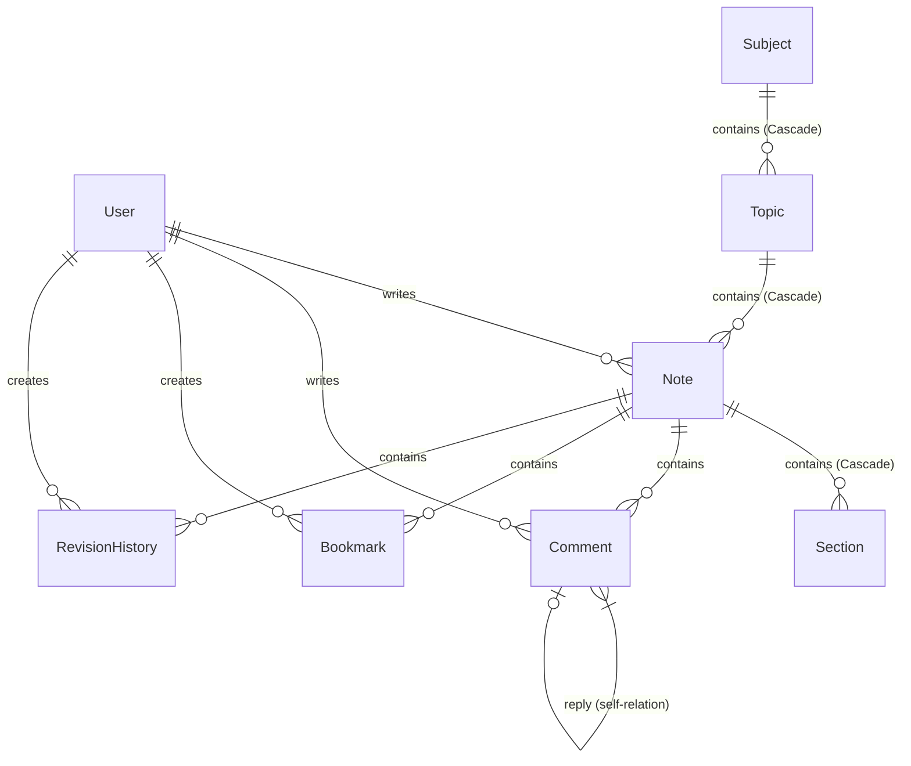

# RecallStack Architecture Documentation

RecallStack is a developer-centric personal knowledge management platform designed around a structured 4-level knowledge hierarchy: **Subject → Topic → Note → Section**.

---

## 1. Core Hierarchy (4 Levels)

```
Subject (Admin-Created)
 └── Topic (Admin-Created under Subject)
      └── Note (User-Created under Topic)
           └── Section (User-Created under Note)
```

1. **Subject**: High-level learning areas (e.g., *Data Structures & Algorithms*, *System Design*, *Web Development*).
2. **Topic**: Specific domains within a subject (e.g., *Sorting Algorithms* under *DSA*, *Caching* under *System Design*).
3. **Note**: Curated learning logs, summaries, or guides written by users (e.g., *Merge Sort Complete Guide*).
4. **Section**: Content blocks within a note. Support multiple types such as `TEXT`, `CODE` (with syntax highlighting), `EXAMPLE`, `IMAGE`, and `DIAGRAM`. Allows easy auto-ordering and reordering.

---

## 2. Database Schema Design (Prisma)

The application uses PostgreSQL with Prisma ORM. Below is the simplified representation of core models and their relationships:



### Key Models & Fields

- **Subject**:
  - `topicsCount` and `notesCount`: Denormalized integers for $O(1)$ reads on the homepage.
  - Slug: Unique and URL-friendly.
- **Topic**:
  - `notesCount` and `lastUpdated` (timestamp of latest published note): Denormalized fields to keep subject browse pages efficient.
  - Unique constraint on `[subjectId, slug]`.
- **Note**:
  - `readingTime`: Calculated dynamically from text/example section word counts (assumes 200 words/minute).
  - `status`: Enum (`DRAFT`, `PUBLISHED`, `ARCHIVED`). Only published notes increment parent counts and show on public feeds.
- **Section**:
  - `order`: Sequential integer representing display position.
  - `contentType`: Enum (`TEXT`, `CODE`, `EXAMPLE`, `IMAGE`, `DIAGRAM`).
  - `language`: Code syntax highlighting label (e.g., `javascript`, `cpp`).

---

## 3. High Performance / Denormalization Strategy

To ensure sub-millisecond query responses on heavily accessed pages (like the homepage and subject lists), RecallStack denormalizes counters:
- **Topic Creation**: Increments `Subject.topicsCount`.
- **Note Publishing**: Increments `Topic.notesCount` and `Subject.notesCount`.
- **Note Deleting/Archiving**: Decrements counts only if the note was previously `PUBLISHED`.
- **Section Modification**: Recalculates `Note.readingTime` asynchronously or at the controller level during create/update/delete.

All count updates are executed inside database **transactions** (`prisma.$transaction()`) to guarantee ACID properties and prevent count drifts.

---

## 4. Authentication & Security Architecture

RecallStack employs a token-based authentication mechanism:
- **Password Protection**: Hashed using **bcryptjs** (10 rounds) before database storage.
- **Session Tokens**: Short-lived JSON Web Tokens (JWT) signed with a server secret (expiry: 7 days).
- **Middlewares**:
  - `authenticateToken`: Standard guard enforcing valid JWT presence on `req.headers['authorization']`.
  - `optionalAuth`: Evaluates JWT if present (e.g., to see drafts owned by the current user) but doesn't reject unauthenticated requests.
  - `adminOnly`: Rejects requests where user's `role !== 'ADMIN'`.

---

## 5. Front-End Design System & Layout

The frontend is built using Next.js with a premium dark-themed layout:
- **Theme**: Custom HSL-based palette styled using custom properties (`--color-bg`, `--color-primary`, `--glass-bg`, etc.).
- **Visuals**: Ambient glows, responsive glassmorphism cards, and staggered fade-in delays.
- **Monospace Font**: Integrated `JetBrains Mono` for pristine code representation.
- **Code Block Rendering**: Done client-side with optimized imports of `highlight.js` covering common languages.
